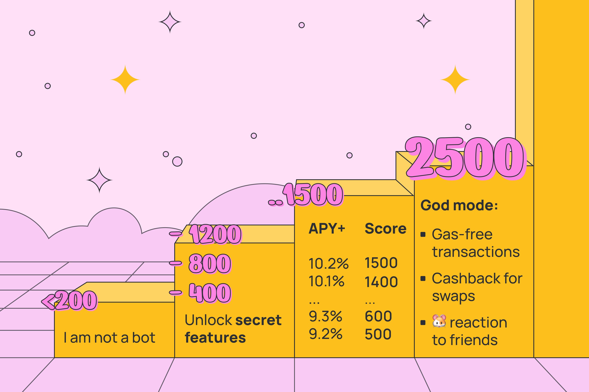

# HERE Storage

### Abstract

The smart contract implements the NEP-141 spec (similar to ERC-20) to store user funds. In exchange for the NEAR, the user receives tokens of the wrapped NEAR. Most of the money held on the contract is stacking, but some are always left free. This allows the user to swap hNEAR to NEAR at any time without commission and use their funds.

For transactions within the wallet, hNEAR is used. For transactions with third-party users first conversion hNEAR to NEAR and then transfer NEAR.

The `astostaking` project is used for staking. Users receive an accrual of interest to their hNEAR account on demand. The resulting income can be withdrawn at any time, turning it into NEAR.


More about astostaking


### Money management

**There are private methods for controlling steaking**

* `stake(&self, amount: U128)`
* `unstake(&self, amount: U128)`
* `deposit_stake(&self, amount: U128)`
* `withdraw_stake(&self, amount: U128)`

With them, the owner has full access to the allocation of staking. The calls duplicate the management methods "astro-stakers.poolv1.near". `(stake, unstake, deposit, withdraw)`

**And public methods for controlling steaking**

* `public_force_unstake(&mut self)`
* `public_force_withdraw(&self)`

With the help of the community can hijack the control. If the security on the storage balance drops below 5% you can call methods `public_force_unstake`, `public_force_withdraw`. This will lead to the withdrawal of funds from "astro-stakers.poolv1.near" and freeze the staking control for 6 epochs. Also, the first to find the problem will be paid a bonus of 1 hNEAR.

### Staking income

#### Owner

The owner can get his dividends at any time, using the method `recive_owner_dividends(amount)`. `amount` must be less than the total balance of all users and the number of accumulated dividends. The method `get_account_total_balance()` on the `astostaking` the contract will be called to check the storage balance. If the check is successful, the owner has received it on his account hNEAR.

#### User

User can receive their dividends at any time, using the method `recive_dividends`. User will receive hNEAR = `user_balance / 1000 * apy_value / ONE_YEAR_TS * (NOW_TS - last_accrual_ts)`. 0 <= `apy_value` <= 1000
