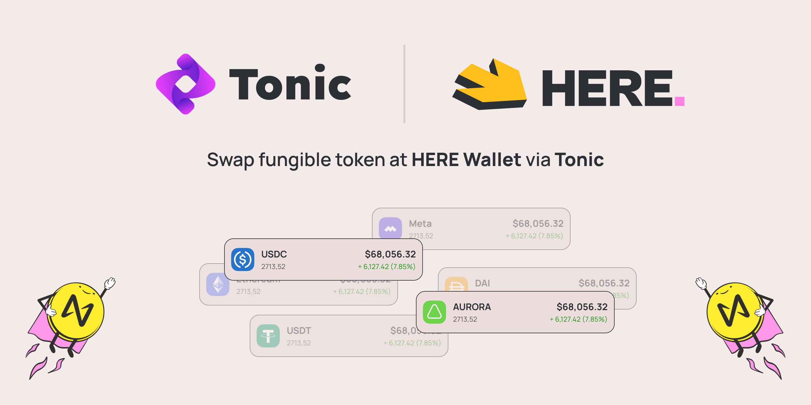

# Tonic DEX

<figure><figcaption></figcaption></figure>

Thanks to the collaboration with[ Tonic ](https://twitter.com/tonicdex)we will be able to get the minimum fee for the conversion of fungible tokens. About 0.1% instead of 0.3% at [ref.finance](https://t.co/pPQot4WUhC)
