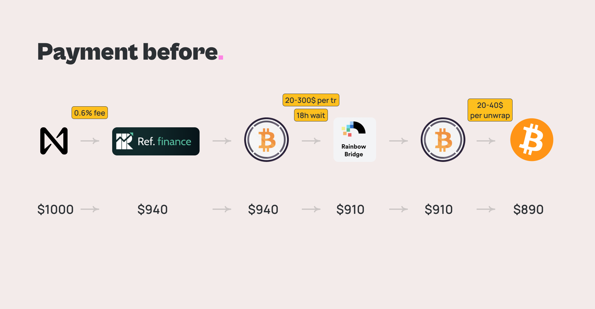
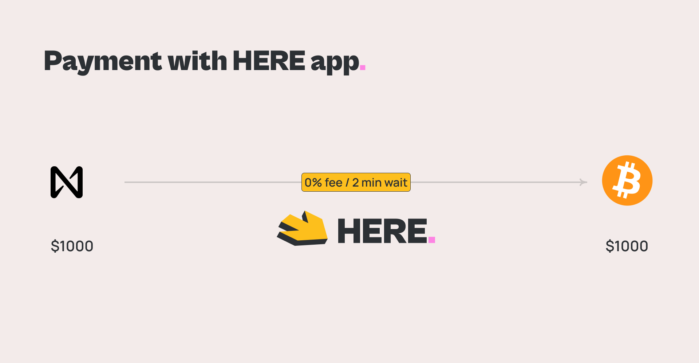

# BTC Bridge

### Why do I need BTC in HERE wallet?

1. Most services that accept cryptocurrencies accept bitcoin. If you want to use NEAR for real-world purchases, you need to be able to convert it to BTC. And it should be not a wBTC, but a real bitcoin, which you can send to the seller
2. Bitcoin is also the most popular cryptocurrency. If you want to buy NEAR today, you probably already have bitcoin. At the same time, buying NEAR for BTC requires no intermediaries and no KYC. This is the easiest and safest way to buy your first NEAR

### How we can buy BTC for NEAR now?

In fact, today there is already a way to get BTC for your NEAR. To do this you need to:

1. buy wBTC in NEAR via ref.finance (0.3- 0.6% fee) (5c)
2. send them to ethereum over the Rainbow bridge (18h + 20-300$ fee)
3. unwrap wBTC and get BTC (20-40$, 10min)
4. send BTC to the seller

It will take a lot of time, spend 0.3% + \~50$ commission and require the use of 4 services

### **How the bridge works in HERE:**

1. buy wBTC in NEAR via tonic (0.1% fee)
2. send wBTC to smart contract indicating the `target address` for the transfer
3. we will immediately send our BTC to `target address`
4. when oracles will confirm the transfer, wBTC will be transferred from the smart contract to our account
5. when we have a lot of wBTC we convert them to BTC using [Scheme 1](btc-bridge.md#how-buy-btc-for-near-now) into one transaction


For the user, this process takes about a few minutes and only requires a fee for sending bitcoin. All transactions processed in the background. You just scan the QR code and you can immediately pay in BTC by spending your NEAR!


### How safe is it?

This method of purchase is absolutely safe. We use oracles to confirm payments. This is a set of independent validators that vote to confirm the payment. If the validators do not detect the transfer to `target address` at the bitcoin network within an hour, the request will be canceled and the wWBTC will be returned to the user account. Only if validators will confirm BTC transfer, wBTC will be transferred to HERE account.


